# Forum-Angular
This application use Angular and Node, its functionality is a forum using CRUD. Developed with node version 18.4.0.

### Functionality
- Register new users
- Log in functionality to access options that are hidden otherwise
- Update data from user logged
- Create and update blogs
- Create and delete comments in the selected blog
- Pagination when there are more than 5 blogs on the DB
- Pages protected with **canActivate**
- Invalid url route redirects to Error Page

## Installation
To install this project follow the next steps:
1. Download the repository found here: [Forum-Angular](https://github.com/SuaferoanTJK/Forum-Angular).
2. Inside **forum-node** folder, in the **variables.env** file change the values of "data" with the url to connect to your account in mongoDB, and "any" with a random text (Remove the tag elements). 
3. Start a terminal inside the folder **forum-node**.
4. Run **npm install** script.
5. Run **npm run dev** script.
6. Start another terminal, this one located inside the **forum-angular** folder
4. Run **npm install** script.
5. Run **ng serve** script.
8. Go to http://localhost:4200

## Screenshots

  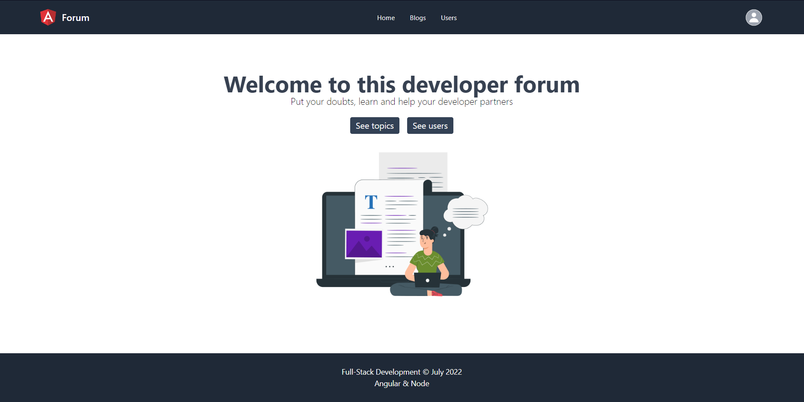
  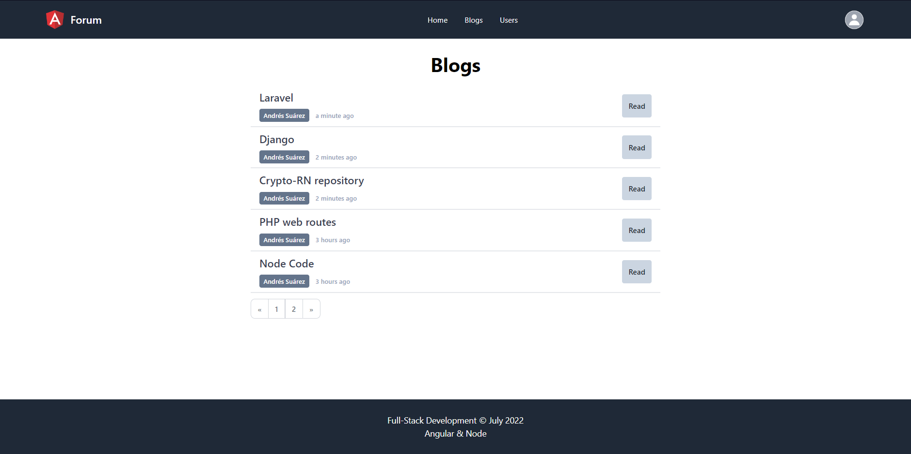
  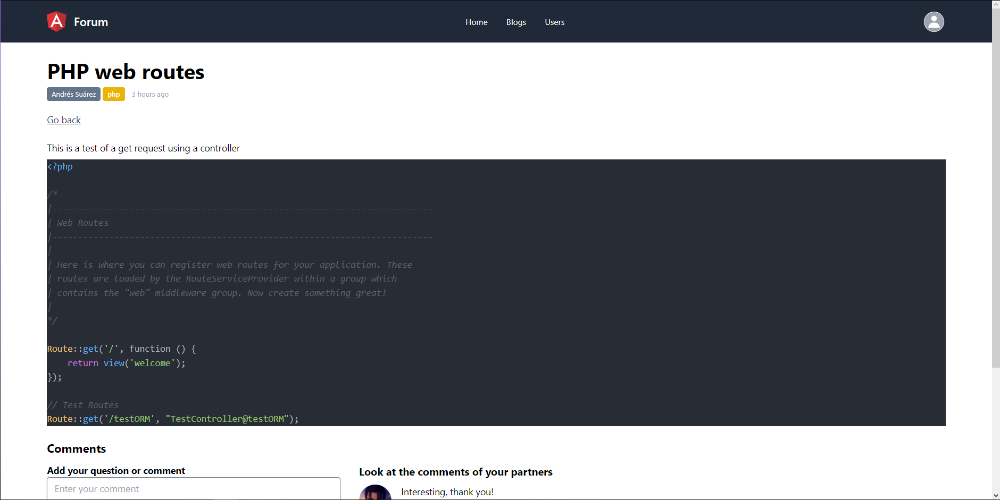
  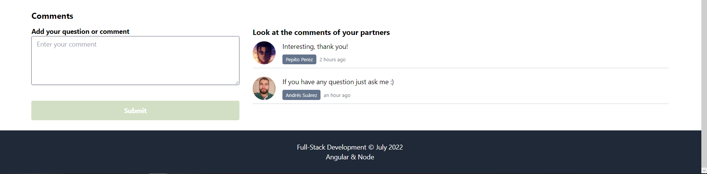
  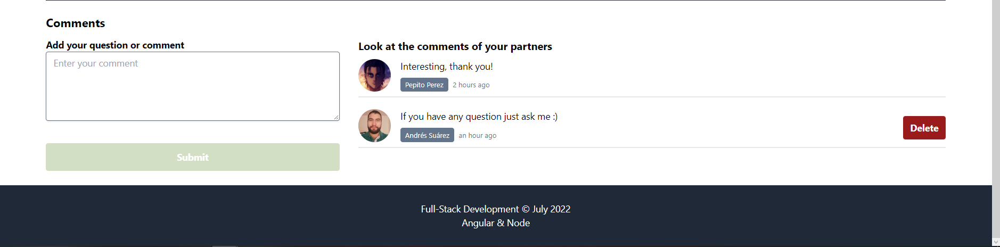
  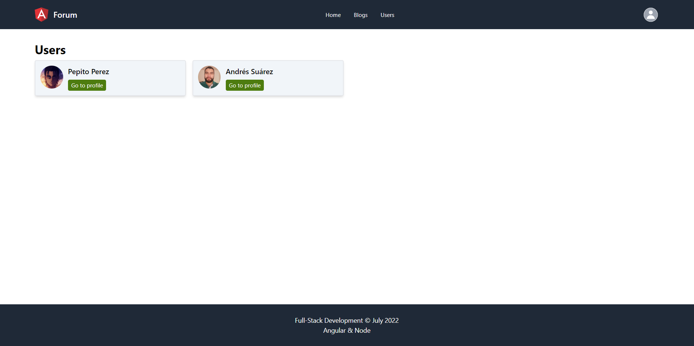
  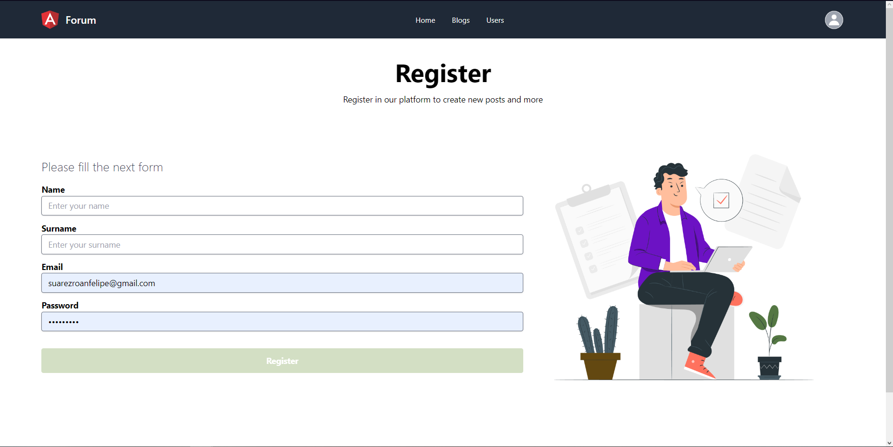
  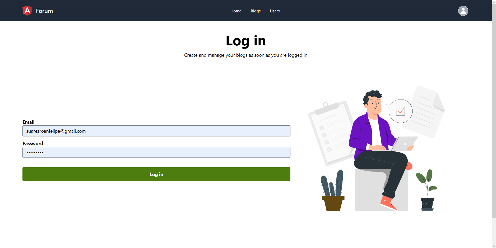
  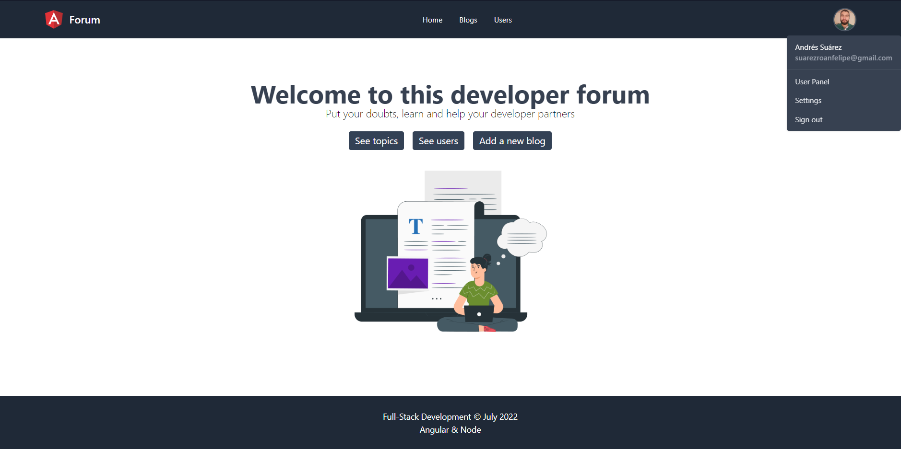
  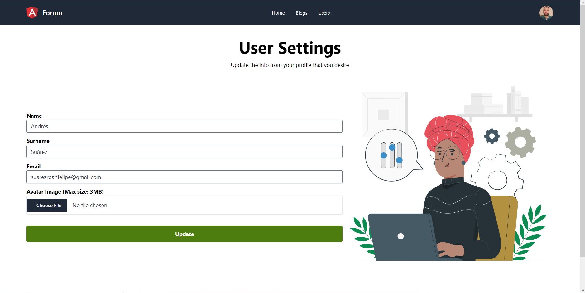
  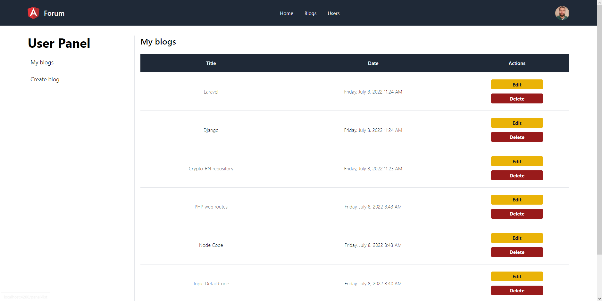
  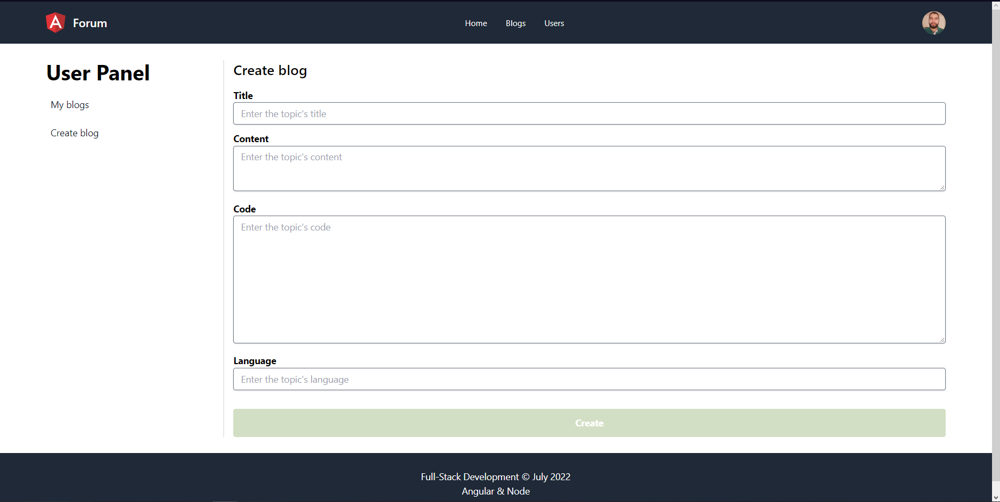
  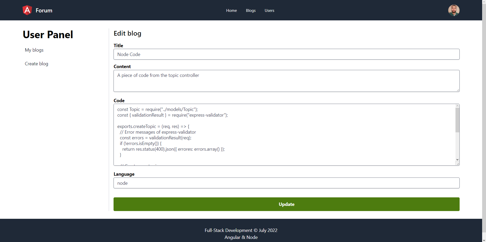
  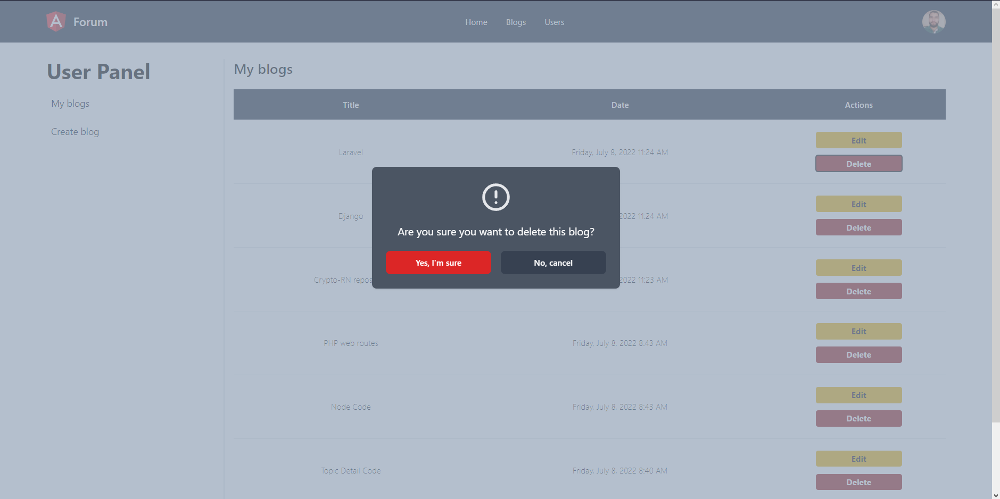

## Get in touch
### LinkedIn
https://www.linkedin.com/in/andrés-f-suárez/
